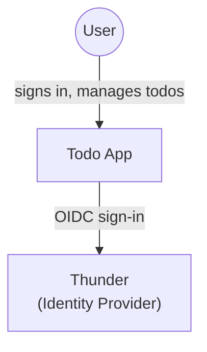
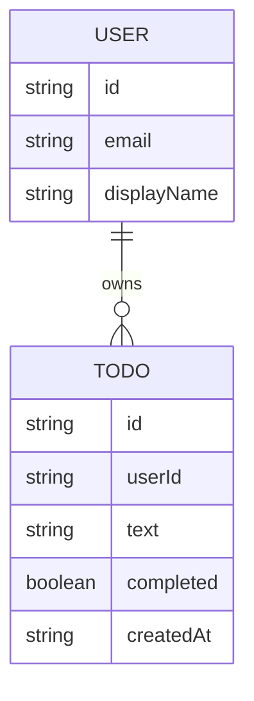
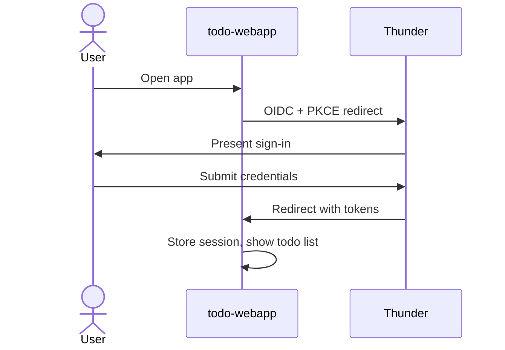
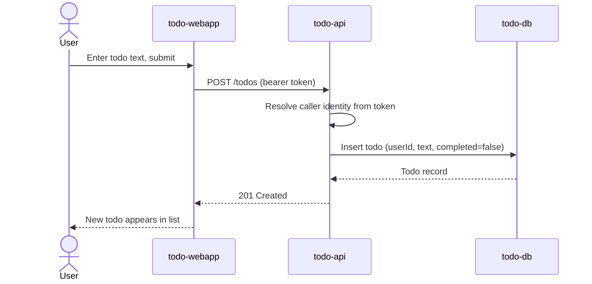
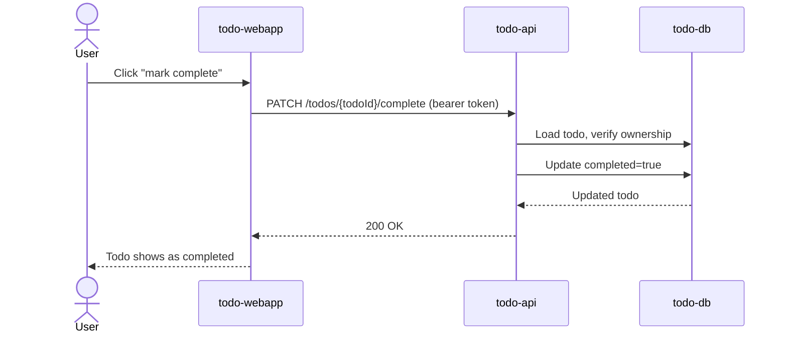

## Overview

A simple todo app: a signed-in User creates todos and marks them complete.
`todo-webapp` is the React single-page app the user works in; it calls
`todo-api`, a Ballerina service that owns the Todo entity and persists it in
`todo-db`. Sign-in for both the SPA and the API runs through Thunder, the
platform identity provider, so every todo is scoped to the signer's own
identity and no user ever sees another user's list.

## Context (C1)

## Domain model (ER)

`USER` is resolved from the Thunder-issued token (not a table this system
owns); `TODO` is the one entity `todo-api` persists, always scoped by
`userId`.

## Key flows

### Sign in

### Create a todo

### Mark a todo complete

